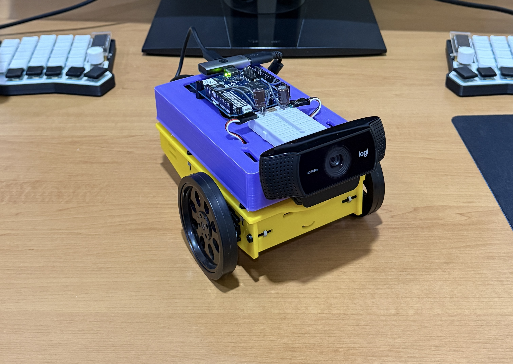
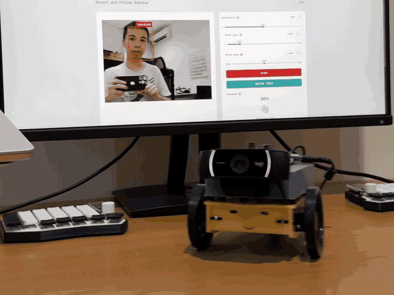
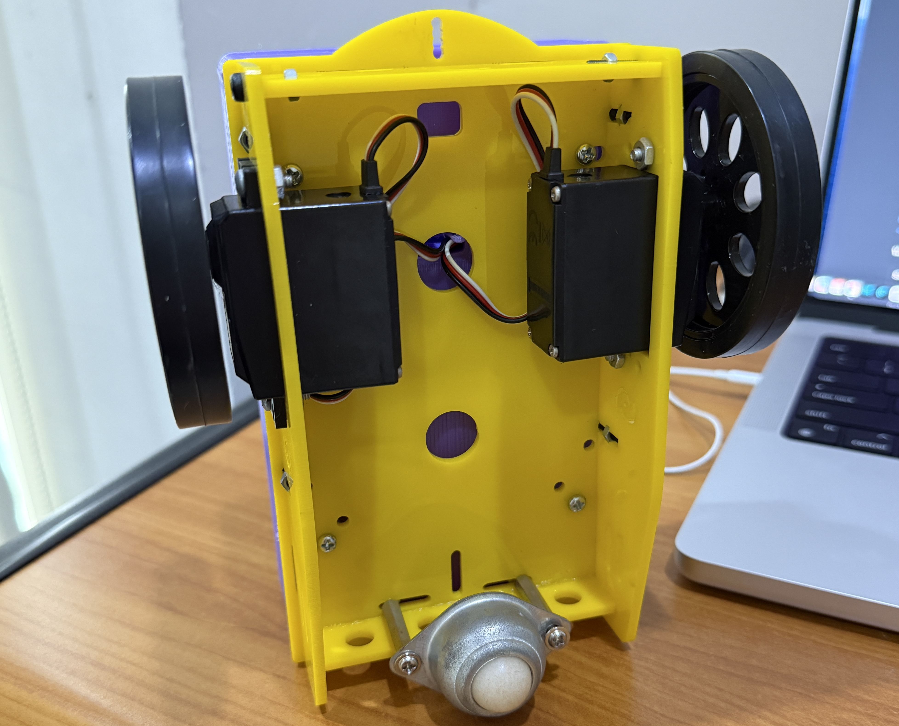
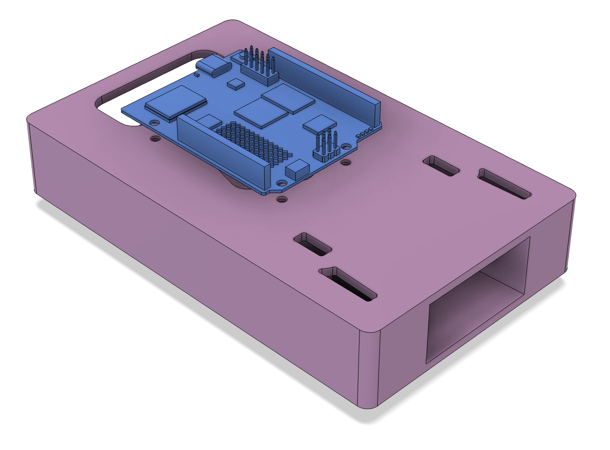
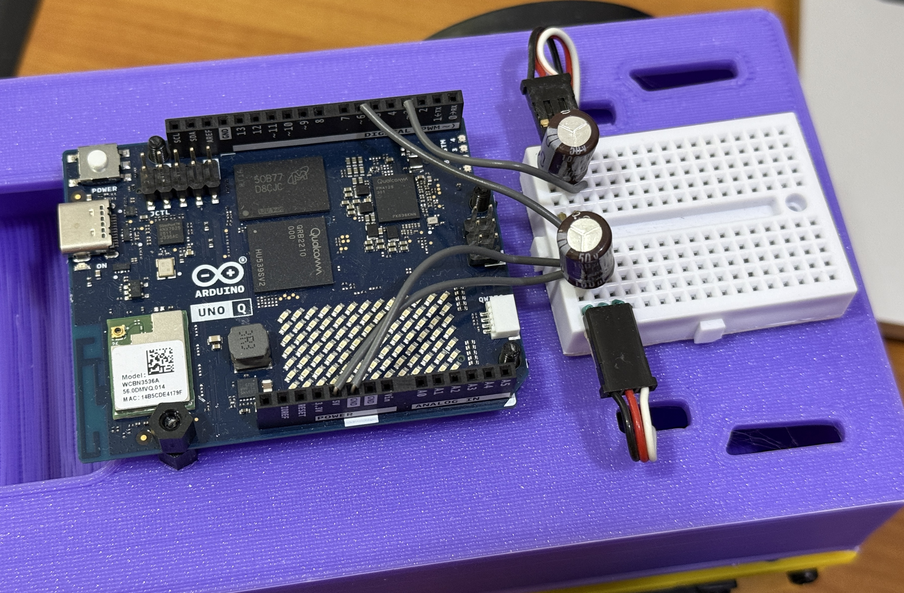
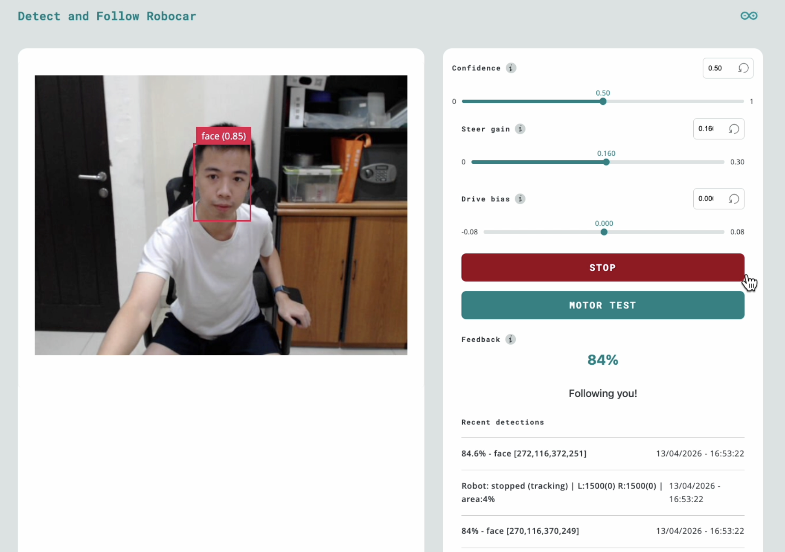

# Face-following robot with Arduino UNO Q and Edge Impulse

Build a desk-sized robot that detects a human face using on-device ML and steers toward it in real time,  all running on the [Arduino UNO Q](https://store.arduino.cc/products/uno-q).

**Created by:** Samuel Alexander  
**Edge Impulse public project:** https://studio.edgeimpulse.com/public/953867/live  
**GitHub repository:** https://github.com/SamuelAlexander/face-following-robot-uno-q  
**Demonstration video:** https://youtu.be/TYtrBvlE7Mc



## Introduction

This project combines computer vision and robotics on a single board. A camera captures video, a lightweight face-detection model (powered by Edge Impulse) locates the face, and a proportional controller converts that position into differential wheel commands, all at ~10-15 FPS.

The UNO Q's **split architecture** makes this possible:

- **MPU** (Qualcomm, Linux) --> runs the ML model and control logic in Python
- **MCU** (STM32, Zephyr RTOS) --> drives servo PWM with real-time precision

The two processors communicate over **Bridge RPC**, a MessagePack-based protocol over an internal serial link. This separation keeps heavy inference off the real-time path and motor control deterministic.

A browser-based **Web UI** lets you monitor detections and tune steering parameters live, no recompilation needed.



### What you'll learn

- How the UNO Q's MPU/MCU split architecture works
- Using App Lab **bricks** (pre-built middleware) for AI and web interfaces
- Bridge RPC communication between Python and an Arduino sketch
- Proportional steering control for differential-drive robots
- Live parameter tuning through a Socket.IO web dashboard

## Prerequisites

### Hardware

| Component | Used in This Project | Notes |
|---|---|---|
| Arduino UNO Q | — | 2 GB or 4 GB variant |
| USB webcam | Logitech C922 Pro Stream | Most UVC-compatible webcams work |
| 2x continuous-rotation servo | Parallax Continuous Rotation Servo | Any continuous servo with 1000-2000 us pulse range |
| USB-C power bank (PD) | 20000 mAh, USB-C PD output | Must supply stable 5 V / 2+ A |
| USB-C splitter | With USB-A port | Powers UNO Q via USB-C, camera via USB-A |
| Small decoupling capacitors | 100 uF electrolytic across servo power/GND | Reduces servo electrical noise |
| Robot chassis | Custom 3D-printed (STL files included) | Any two-wheel platform works |
| Jumper wires | — | Signal + power for servos |

### Software

- **Arduino App Lab v0.6** or later (runs in-browser, no local install needed)
- A computer on the same network as the UNO Q
- Edge Impulse Studio account

### Source code

The full project source is available at: https://github.com/SamuelAlexander/face-following-robot-uno-q  

## Architecture overview

The system has three layers:

```
┌──────────────┐    Socket.IO   ┌────────────────────────────────┐
│   Browser    │◄──────────────►│  MPU (Linux / Python)          │
│   Web UI     │                │  - VideoObjectDetection brick  │
│   Tuning +   │                │  - Steering controller         │
│   Monitoring │                │  - WebUI brick                 │
└──────────────┘                └──────────┬─────────────────────┘
                                           │ Bridge RPC (MsgPack)
                                ┌──────────▼─────────────────────┐
                                │  MCU (STM32 / Zephyr RTOS)     │
                                │  - Receives pulse commands     │
                                │  - Drives PWM on D3 + D6       │
                                └──────────┬─────────────────────┘
                                           │ PWM (50 Hz, 1000-2000 us)
                                ┌──────────▼─────────────────────┐
                                │  Left servo    Right servo     │
                                └────────────────────────────────┘
```

**Why split MPU and MCU?** ML inference is computationally heavy and non-deterministic, it belongs on a Linux processor. Servo PWM timing is safety-critical and must be jitter-free, it belongs on a real-time microcontroller. Bridge RPC connects the two with ~8 ms round-trip latency.

## Hardware assembly

### Chassis overview

The robot uses a simple **differential-drive** layout:

- Two continuous-rotation servos mounted on opposite sides
- A rear caster or skid point for stability
- A top-mounted platform for the UNO Q and camera
- The USB power bank sits on or below the platform as ballast

Continuous-rotation servos simplify wiring. A 1500 us pulse means stop, below 1500 spins one way, above 1500 spins the other.





### Wiring

| Servo | Signal Pin | Power | Ground |
|---|---|---|---|
| Left wheel | D3 | 5 V | GND |
| Right wheel | D6 | 5 V | GND |

Place a **100 uF capacitor** across the servo power and ground rails to absorb current spikes.

Connect the webcam to the USB-A port on the USB-C splitter. The USB-C side powers the UNO Q.



> **Note:** The right servo is mounted mirrored relative to the left. The firmware handles this with a pulse inversion flag, no crossed wires needed.

## Project setup in App Lab

### File structure

Every App Lab project follows this layout:

```
detect-and-follow-robocar/
├── app.yaml              # App manifest: bricks and model selection
├── python/
│   └── main.py           # MPU application (detection + control)
├── sketch/
│   ├── sketch.ino        # MCU firmware (servo PWM)
│   └── sketch.yaml       # Build config (board, libraries)
└── assets/
    ├── index.html         # Web UI page
    ├── app.js             # Web UI logic (Socket.IO client)
    └── style.css          # Styling
```

### Configuring bricks

**Bricks** are pre-built middleware packages that run on the MPU. They provide high-level capabilities without writing boilerplate. This project uses two:

In `app.yaml`:

```yaml
name: Detect and follow robocar
description: Robot car that follows a target object.
bricks:
- arduino:video_object_detection:
    model: face-detection
- arduino:web_ui: {}
icon: 🚙
```

- **`video_object_detection`**, captures camera frames, runs the face-detection model, and delivers results to your Python code via callbacks
- **`web_ui`**, serves the HTML/JS dashboard and provides a Socket.IO server for real-time communication

The `model: face-detection` line selects a built-in lightweight face-detection model. No training or Edge Impulse account needed.

### Sketch dependencies

In `sketch/sketch.yaml`, the key libraries are **Arduino_RouterBridge** (Bridge RPC) and **Servo** (PWM output):

```yaml
profiles:
  default:
    fqbn: arduino:zephyr:unoq
    platforms:
      - platform: arduino:zephyr
    libraries:
      - Arduino_RouterBridge (0.4.1)
      - Servo
      - MsgPack (0.4.2)
```

## The MCU sketch: Servo control

The MCU firmware is intentionally minimal, it receives pulse-width commands over Bridge RPC and writes them to the PWM hardware. All decision-making lives on the MPU.

### Bridge RPC endpoint

The sketch exposes a single function that the MPU can call. It uses the Arduino **Servo** library for reliable pin-level PWM output:

```cpp
#include <Arduino_RouterBridge.h>
#include <Servo.h>

Servo leftServo;
Servo rightServo;

bool set_wheel_pwm(int left_us, int right_us) {
  uint32_t left  = clamp_pulse_us(left_us);   // Clamp to 1000-2000
  uint32_t right = clamp_pulse_us(right_us);

  left  = apply_invert(left,  kInvertLeftWheel);   // false
  right = apply_invert(right, kInvertRightWheel);   // true — right is mirrored

  leftServo.writeMicroseconds(left);    // D3
  rightServo.writeMicroseconds(right);  // D6
  return true;
}

void setup() {
  Bridge.begin();
  leftServo.attach(3);
  rightServo.attach(6);
  leftServo.writeMicroseconds(1500);   // Start stopped
  rightServo.writeMicroseconds(1500);
  Bridge.provide_safe("set_wheel_pwm", set_wheel_pwm);
}

void loop() {}   // All control is event-driven via RPC
```

**Key concepts:**

- **Arduino Servo library** handles PWM output via `attach(pin)` and `writeMicroseconds()`. This is more portable than the low-level Zephyr PWM API (`pwm_set_dt`), which depends on devicetree index mappings that can vary between board revisions.
- **`Bridge.provide_safe()`** registers the function so it runs in the Arduino `loop()` context, safe for hardware operations like PWM writes. Never use `Bridge.provide()` for GPIO/servo/motor calls, as that runs in a background RPC thread where hardware APIs can fail.
- **Pulse inversion** handles the mirrored right servo: `inverted = 3000 - pulse`. This mirrors the pulse around the 1500 us stop point, so the same "forward" command from Python moves both wheels in the same physical direction.
- **Empty `loop()`** is correct, the Bridge library hooks into the loop internally to dispatch queued `provide_safe` callbacks.

### Continuous-rotation servo basics

| Pulse (us) | Behavior |
|---|---|
| 1500 | Stop |
| 1000 | Full speed, one direction |
| 2000 | Full speed, opposite direction |

The closer to 1500, the slower the wheel turns. This project uses offsets up to ±125 us for responsive but desk-safe motion.

## The MPU application: Detection to steering

The Python application on the MPU handles three responsibilities: receiving detections from the vision brick, computing steering commands, and communicating with both the MCU and the web UI.

### Brick initialization

```python
from arduino.app_utils import App, Bridge
from arduino.app_bricks.web_ui import WebUI
from arduino.app_bricks.video_objectdetection import VideoObjectDetection

ui = WebUI()
detection_stream = VideoObjectDetection(confidence=0.5, debounce_sec=0.0)
```

The `VideoObjectDetection` brick fires a callback every time it processes a frame. The `on_detect_all` variant fires for every frame, including ones with no detections, useful for keeping a watchdog timestamp fresh:

```python
detection_stream.on_detect_all(on_detections)
App.run()
```

### Detection format

The brick delivers detections as a dictionary, with each label mapped to a **list** of detection instances:

```python
{
    "face": [
        {"confidence": 0.89, "bounding_box_xyxy": (144, 83, 234, 209)},
        # ...more faces if multiple detected
    ]
}
```

Each instance contains a `confidence` score and a `bounding_box_xyxy` tuple of `(x_min, y_min, x_max, y_max)` in pixel coordinates. The `TARGET_CLASS` constant must match the model's label exactly, "face"` for the built-in face-detection model.

> **Important:** The per-label value is always a list, even for a single detection. Code that expects a plain dict per label (without the list wrapper) will silently miss all detections.

### Proportional steering controller

The controller converts the face's horizontal position into differential wheel commands:

```
1. Find the face's bounding box center
2. Normalize to 0.0 (left edge) — 1.0 (right edge)
3. Compute heading error: (center - 0.5) x 2.0  →  range -1.0 to +1.0
4. Apply deadband (ignore small errors to suppress jitter)
5. Shape response with a power curve (compress large errors)
6. Scale by STEER_GAIN → turn speed
7. Convert to differential pulses: left = 1500 + turn, right = 1500 - turn
```

```python
heading_error = (target_cx - 0.5) * 2.0
if abs(heading_error) < CENTER_DEADBAND:
    heading_error = 0.0

shaped = math.copysign(abs(heading_error) ** STEER_CURVE, heading_error)
turn = clamp(STEER_SIGN * STEER_GAIN * shaped, -MAX_TURN_SPEED, MAX_TURN_SPEED)

left_us  = speed_to_pulse(turn)    # 1500 + turn x 500
right_us = speed_to_pulse(-turn)   # 1500 - turn x 500
```

The **power curve** (`STEER_CURVE = 0.4`) makes the response more aggressive for small errors and softer near the frame edges, a simple alternative to PID that works well for this use case.

### Coasting and lost target

When the face momentarily disappears (occlusion, blink, brief look-away), the controller **coasts** on the last-known position for `TRACKING_TIMEOUT` seconds (default 0.5s) before declaring the target lost. This avoids jittery stop-start behavior.

When the target is truly lost, the robot stops. An optional search mode (disabled by default) slowly rotates to scan for the face.

### Bridge communication and rate limiting

The UNO Q Bridge has no internal queue, sending commands too fast crashes the serial link. The application rate-limits Bridge calls to a maximum of 20 Hz (50 ms intervals):

```python
MIN_BRIDGE_INTERVAL = 0.05  # seconds

if now - _last_bridge_ts < MIN_BRIDGE_INTERVAL:
    return   # Skip this update

Bridge.notify("set_wheel_pwm", left_us, right_us)
```

`Bridge.notify()` is fire-and-forget (no response waited), which avoids blocking the inference loop. `Bridge.call()` would wait for a return value and slow down the control loop.

> **Safety note:** The emergency stop bypasses rate limiting entirely to guarantee the MCU receives the stop command immediately.

### Watchdog

A background thread checks whether detection callbacks have stopped arriving. If no callback fires for 1.5 seconds (indicating a camera or pipeline failure), the watchdog forces a stop command:

```python
def _watchdog_loop():
    while True:
        time.sleep(0.25)
        if time.monotonic() - _last_detection_ts > NO_DETECTION_TIMEOUT:
            send_lost_target_command()
```

## The web UI

The dashboard runs in any browser on the same network and provides live monitoring and parameter tuning.



### Features

| Element | Function |
|---|---|
| **Video stream** | Live camera feed via iframe (port 4912) |
| **Confidence slider** | Adjusts minimum detection confidence (0.0-1.0) |
| **Steer gain slider** | Controls how aggressively the robot turns (0-0.30) |
| **Drive bias slider** | Adds fixed forward/backward offset (-0.08 to +0.08) |
| **Emergency stop** | Immediately halts all wheel motion |
| **Motor test** | Runs a left-right-stop sequence to verify servo wiring |
| **Feedback** | Visual confirmation when a face is detected |
| **Recent detections** | Live log of the last 5 detection and state events |

All slider changes take effect immediately via Socket.IO, no restart required. This makes tuning fast: adjust a slider, observe the robot's response, repeat.

## Deploy and run

### Option A: App Lab GUI

1. Open **Arduino App Lab** in your browser
2. Create a new app or import the project files
3. Click **Run, App Lab compiles the sketch, flashes the MCU, and starts the Python app

### First boot checklist

1. **Check the log** for the `sample_detections` line, it prints the raw detection payload on the first frame. Verify:
   - The label is `"face"` (matches `TARGET_CLASS`)
   - The bounding box coordinates are reasonable for your camera resolution
2. **Open the Web UI** at `http://<UNO_Q_IP>:7000`, you should see the video stream and detection events appearing in "Recent detections"
3. **Verify servos**, press the **Motor Test** button in the UI. Both wheels should turn left, pause, then turn right. If not, check wiring and servo power before proceeding to face tracking.


## Tuning guide

### Steering direction

If the robot turns *away* from your face instead of toward it, flip the steering sign in `main.py`:

```python
STEER_SIGN = -1.0   # Flip if left/right tracking is mirrored
```

### Frame width calibration

Check the `sample_detections` log output. If the max `x` coordinate in `bounding_box_xyxy` is significantly different from `FRAME_WIDTH_FALLBACK` (default 640), update the constant to match. A wrong value causes asymmetric or weak steering.

### Gain tuning

Start with these defaults and use the Web UI sliders to adjust:

| Parameter | Default | Effect |
|---|---|---|
| `STEER_GAIN` | 0.15 | Higher = faster turns, risk of overshoot |
| `MAX_TURN_SPEED` | 0.25 | Hard cap on wheel speed (~±125 us). Must exceed servo dead zone. |
| `CENTER_DEADBAND` | 0.05 | Larger = more tolerance before turning |
| `DRIVE_BIAS` | 0.0 | Positive = creep forward, negative = backward |

**Workflow:** Start with the robot on a desk. Increase `STEER_GAIN` until the robot centers on your face smoothly. If it oscillates (overshoots left-right), reduce the gain. Once tuned, update the defaults in `main.py` so the robot starts with good values.

## Troubleshooting

| Symptom | Likely Cause | Fix |
|---|---|---|
| UI shows detections but "lost target - stopped" | `TARGET_CLASS` doesn't match model label | Check `sample_detections` log, set `TARGET_CLASS` to the exact label string |
| Wheels don't move at all | Servo power, wiring, or Bridge issue | Use the **Motor Test** button to isolate; check servo power rail and signal wires on D3/D6 |
| Robot turns the wrong way | Steering sign or inversion mismatch | Flip `STEER_SIGN` to `-1.0`; or swap `LEFT/RIGHT_WHEEL_INVERTED` flags |
| Jerky, oscillating motion | Gain too high or deadband too low | Reduce `STEER_GAIN` via slider; increase `CENTER_DEADBAND` |
| Video stream not loading | Camera not detected | Check USB connection; try a powered USB hub |
| Emergency stop doesn't work | Socket.IO disconnected | Check for error banner in the Web UI |
